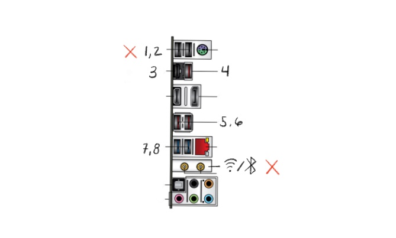

# Z390 e-Gaming (BIOS 1602) + 9900k = OpenCore 0.5.8 on Catalina 10.15.7
I recently swapped cases / motherboards and this repository is being updated to reflect that.

## TOC
---
* [Parts](#parts)
* [What Works](#what-works)
* [USB Mapping](#usb-mapping)
* [BIOS](#bios)

## Setup
---
It is **strongly** recommended that people use the official [OpenCore installation guide](https://dortania.github.io/OpenCore-Install-Guide/) instead of copy pasting this EFI into your own setup. This repository is for my personal use and version controlling my own EFI.

That being said, be sure to update `PlatformInfo` before loading OpenCore with this `config.plist`.

## Parts
---
* [ASUS ROG Strix Z390-E Gaming Motherboard](https://www.asus.com/us/Motherboards/ROG-STRIX-Z390-E-GAMING/) (BIOS 1602)
* [Intel Core i9-9900k Processor](https://www.intel.com/content/www/us/en/products/processors/core/i9-processors/i9-9900k.html)
* [Sapphire PULSE Redon RX 570 4GB](https://www.newegg.com/sapphire-radeon-rx-570-100412p4gocl/p/n82e16814202283)
* [Samsung 970 EVO Plus NVMe M.2. SSD 500GB](https://www.samsung.com/us/computing/memory-storage/solid-state-drives/ssd-970-evo-plus-nvme-m-2-500gb-mz-v7s500b-am/)
* [Corsair H100i PRO 240mm AIO](https://www.newegg.com/corsair-liquid-cooling-system/p/N82E16835181141)
* [Dual Band BCM94360CS2 PCI-E802.11AC BT4.0 WiFi](https://www.ebay.com/itm/Dual-Band-BCM94360CS2-PCI-E-867Mbps-802-11AC-BT4-0-Wifi-PCI-Express-Adapter-Card/282961128646)

## What Works
---
* Sidecar - Needed to ensure `UHD 630` iGPU was properly setup in `DeviceProperties`
* WiFi
* Bluetooth
* iMessage
* Airdrop
* Sleep
* Shutdown / Restart - [This involved enabling](https://dortania.github.io/OpenCore-Post-Install/misc/rtc.html) `DisableRtcChecksum`

## USB Mapping
---
The `USBMap.kext` is based off my own port discovery. This was needed in order to fix sleep; to meet the 15 port max, I disabled to top two USB motherboard ports.

Once again, it is strongly recommended you [follow the guide and do this yourself via the Dortana USB Mapping Guide](https://dortania.github.io/OpenCore-Post-Install/usb/intel-mapping/intel.html).

*Note: disabling your AIO on MacOS depends on which USB header you plugged it into on the motherboard.*

    
    ASUS Z390-e Gaming Motherboard Port Layout

 

1. Top Left USB / Aura Motherboard + H100i USB - HS06 - `Disabled`
2. Top Right USB - HS13 - `Disabled`
3. Type C Motherboard - HS04, SS04
4. USB Next to Type C - HS03, SS03
5. 2nd to Bottom Left - HS02, SS02
6. 2nd to Bottom Right - HS01, SS01
7. Bottom Left USB - HS10, SS10
8. Bottom Right USB - HS09, SS09

### Case USBs & Bluetooth
* BRCM20702 Hub - HS12 `Type 255`
* Left Case USB - HS07, (SS07 `Disabled`)
* Right Case USB - HS08, SS08

## BIOS
You need to activate the following to make certain things work (i.e. virtualization, Docker, etc.)
* CPU Configuration -> Intel (VMX) Virtualization Technology -> `Enabled`
* System Agent (SA) Configuration -> VT-d -> `Enabled`
* System Agent (SA) Configuration -> Above 4G Decoding -> `Enabled`
* System Agent (SA) Configuration -> Graphics Configuration -> Primary Display -> `PCIE`
* System Agent (SA) Configuration -> Graphics Configuration -> iGPU Multi-Monitor -> `Enabled`
* System Agent (SA) Configuration -> Graphics Configuration -> DVMT Pre-Allocated -> `128M`
* Onboard Devices Configuration -> Serial Port Configuration -> Serial Port -> `Off`
* Fast Boot -> `Disabled`